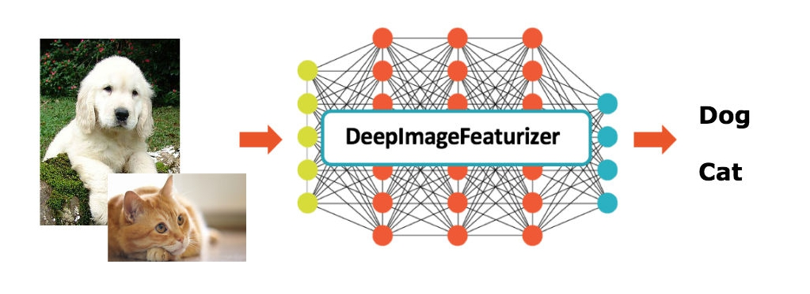
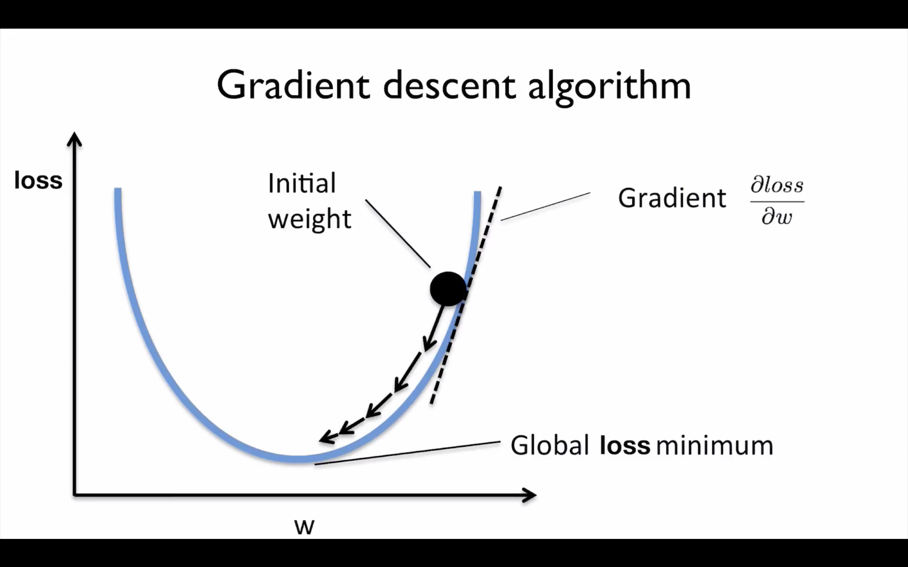
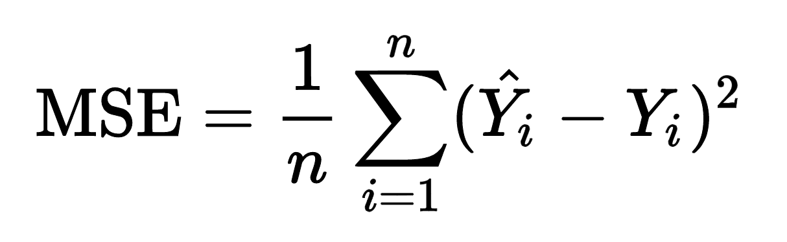
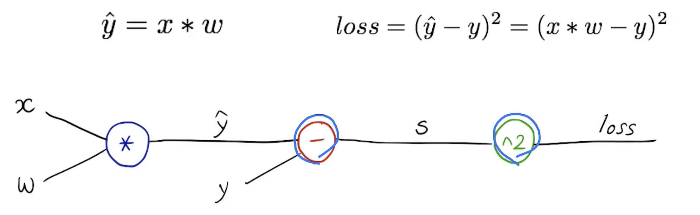
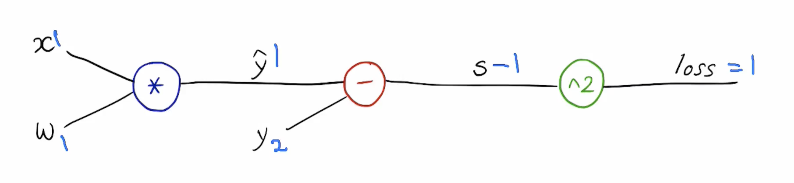
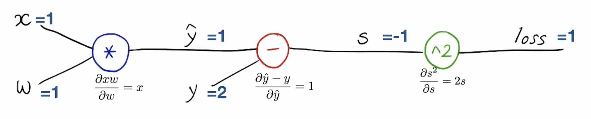
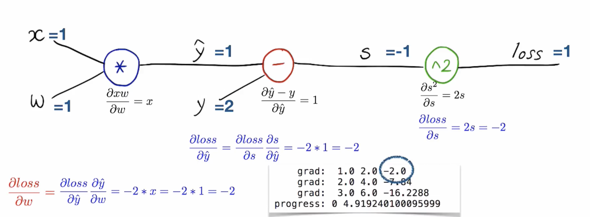

> [Github with MathJax](https://chrome.google.com/webstore/detail/github-with-mathjax/ioemnmodlmafdkllaclgeombjnmnbima)를 설치 하셔야 아래 수식들을 제대로 보실 수 있습니다. 
>
> You might need to install [Github with MathJax](https://chrome.google.com/webstore/detail/github-with-mathjax/ioemnmodlmafdkllaclgeombjnmnbima) in your browser to see the formulas below.

# Basic Concepts of Deep Learning 01
###### Peter Cha 

## Intro

*  Deep Learning을 사용해서 우리가 하고자 하는 일련의 과정은 결국, 우리가 만든 AI(model)가 특정 데이터를 얼마나 잘, 데이터를 구별(classification), 혹은 감지(detection)할 수 있게 할 것인가? 하는 것입니다. AI를 학습시키고자 하는 데이터만 주면, model 스스로 ‘아, A는 이렇게 생겼구나, 이렇게 생기면 B라고 하구나’하고 그 데이터가 가지고 있는 특징(feature)을 스스로 깨우치기 원하는 거죠. 그렇게 잘 학습이 잘 되면, 한 번도 본 적은 없지만 여태껏 봐왔던 특징을 가지고 있는 새로운 이미지를 봤을 때, ‘아, 이건 A야.’혹은, ‘B야’하고 맞출 수 있게 되는 것이구요.

* 더 쉽게 이야기 해보죠. 우리는 강아지와 고양이가 어떻게 생겼는지 우리 model에게 알려주고, 처음보는 강아지나 고양이를 봐도 그 것이 강아지인지, 고양이인지 잘 구별할 수 있었으면 좋겠습니다. 아래 그림처럼 강아지와, 고양이 그림을 엄청나게 많이 주고 우리는 우리가 만든 Model에게 ‘강아지는 이렇게 생긴거야’, ‘고양이는 이렇게 생겼단다.’하고 알려줍니다. 우리는 이 과정을 학습, 혹은 training - learning이라고 부릅니다. 그렇게 잘 학습된 모델은, 훈련할 때 본 적은 없지만, 처음 본 강아지 사진(test)을 봐도 ‘얘는 강아지네요. 고양이는 아니에요’라고 말할 수 있게 됩니다. 

(Image from [KDnuggets](https://www.kdnuggets.com/2017/09/databricks-vision-making-deep-learning-simple.html))

* The purpose of deep learning ends up with the question, "How can we let our AI `classify` or `detect` the certain image or something?" What we want to do is to create the model itself to know the `characteristics` or `feature` of a particular class of data, so it can tell which piece of data it is.

* Let's talk more easily. We would like to be able to tell our model what the puppy and the cat look like and to be able to distinguish whether it is a puppy or a cat even when our model looks at a puppy or cat for the first time. As shown in the picture above, we give a lot of puppies and cats pictures to our model, and we tell the model that 'puppy looks like this', and 'cat looks like this.' This is called, `learning` or `training`. Then, as the process progresses, the model can distinguish the cat from the dog. That's all what we are going to know.

 
 Deep Learning을 이해하고, 직접 Deep Learning을 구현하고자 했을 때 필요한 기본 개념들을 정리해 보았습니다. `학습`이란 무엇을 의미하는지, `Optimizer`는 어떤 역할을 하는 것인지, `Loss function`은 무엇인지, 그리고 마지막으로 `Back propagation`은 어떻게 진행되는지, 간단한 예시를 통해 알아보도록 하겠습니다. :) 
 
 In this post, the Concepts needed when you need to understand what deep learning is and implement deep learning by yourself are organized. Let's start to learn what `Learning` means, `Optimizer` does, `Loss function` is, and How the `Back propagation` works via a simple example. 
 
 
## Learning
- 특정한 값을 예측을 하고 싶다고 하면, 우리는 먼저 실제로 그러한 예측을 할 수 있는 `Model`이 필요합니다. 그리고, 그 <u>모델이 예측한 값(`prediction`)과 실제 값(`grounth truth` or `answer`)과의 값의 차이</u>를 `loss`라고 말합니다.
- 예를 들어, 간단한 선형 모델인 `y = wx`을 우리가 모델로 가지고 있다고 합니다. `y`는 실제 정답이고 `x`는 input값 입니다. 이 때, `w`를 우리는 **weight**라고 부릅니다. 보통 맨 처음엔 이 `w`를 랜덤하게 고릅니다. w가 매우 적절하게 잘 정해져서 실제 정답인 `y`와 `wx`가 똑같은 값이 되었다면 $loss$는 0이 되겠죠!
- 그래서 Input인 x를 주면 정답인 y를 잘 맞추려면, 당연히 우리는 이 w를 잘 맞출 필요가 있습니다. 근데 위에서 말한 것 처럼 w를 랜덤하게 시작해서는 곤란하죠. 한 번 만에 잘 맞춘다는 건 힘듭니다. 
- 그래서 우리는 학습을 진행을 함에 따라, 우리는 <u>무엇이 됐을지 모르는 이 `w`값</u>을 `반복적으로 update`를 시켜서, $loss$를 최소화 할 수 있게끔 만듭니다. 
- 그래서 `학습`이라는 것은 **loss를 최소화 시키는 w 찾기!** 라고 할 수 있습니다. 

- When we predict some values, firstly we need a `model` that can actually do predict, and we call the difference with a prediction and an actual value, ground truch, `loss`.
- For example, if we have a linear model `y = wx`, `y` is the answer, and `x` is input. Then, we call the `w` **weight**. If the weight is set very properly, then the loss will be 0!
- We often choose the inital value of `w` randomly.
- As the training proceeds, we `repeatedly update` this w so that we can find minimizes the loss.
- Therefore, `Learning` is **finding** `w` that **minimizes the loss!**

 

## Optimizer

### Weight update 
- 자,우리는 $loss$를 최소화시키는 $w$를 알고 싶습니다. 그럴 때, $w$가 값에따라, 그림과 같이 $loss$와 $w$의 값으로 그래프를 그렸다고 했을 때, U자로 형성됐다고 생각하고, $loss$를 최소화하는 $w$의 값으로 $w$를 update하고 싶습니다. 시작점은 랜덤하게 정해졌구요.

- w값을 update시키기 위해서, 우리는 다음과 같은 공식을 씁니다. 여기서 $\alpha$가 뜻하는 것은 `learning rate`라고 하는 것인데요, 보통 0.001같은 아주 작은 값이고, 그래서 `다음 학습할 때 쓸 w는 지금 w와 얼마만큼 떨어져있는지`정도를 의미합니다. 
	### $w = w - \alpha  \cdot \frac {\partial loss}{\partial w}$
- 이 w값은 미분을 하면 구할 수 있는데요, 미분의 의미는 결국 아주 작은 구간에서의 `순간변화율`이라고 우리가 알고 있는 만큼, 이는 미분은 곧, 기울기의 정도를 표현한다고 할 수 있죠. 이 $w$값을 구하기 위한 미분 방법은 아래에 나오는 Back Propagation을 소개하면서 다시 이야기 하도록 하겠습니다. 

- 작은 예시로, Back Propagation이 '내가 지금 알고 있는 지식을 가지고 대학교 졸업 후의 나로 돌아 갈 수 있다면, 훨씬 더 좋은 선택과 결정을 하면서 살 수 있을 것이다.' 같은 겁니다. 여기서, 근데 이 learning rate을 너무 크게 설정해줘서, 필요이상으로 군 입대 하루 전으로 돌아간다면 끔찍하겠죠? 그 과거로 '적절히' 돌아가야 지금 가지고 있는 정보를 십분 활용할 수 있기 때문에, 이 learning rate라는 수치가 중요합니다. 

- Let me think we want to know the value of weigh which minimizes the loss. If we draw a graph consists of loss and w, let us consider it looks like a bowl like the image above. Then, we want to `update` the weight to the point which becomes the value minimizing the loss. Of course, the starting point is randomly selected.

- To update the w value, we use follwing equation. `alpha` means `learning rate` which is usually very small number like 0.001, so it means that `How far the next step w is from where now w is.`  

	### $w = w - \alpha  \cdot \frac {\partial loss}{\partial w}$

- As we know, the meaning of derivative is `Instantaneous rate of change`, inclination. Let me introduce the way how to calculate the derivative of w, later on the Back propagation part.

### SGD

- 미분을 이용하여, 만약 미분 결과값이 -인 경우, w는 좀더 양수쪽으로 가게 되고, 반대로는 음수로 가는 방식으로 우리는 w를 update할 수 있습니다. 이런 update 방법을 `Stochastic Gradient Descent` 최적화 - 한국어로는 경사하강법 -, 또는 줄여서 `SGD`라고 부릅니다. 
- SGD 이외에 최적화 기법으로 Adam, Adamx 등등 다양한 기법들이 있습니다만, 클래식한 이런 경사하강법의 방식의 다른 방식이라고 이해해도 크게 틀리지 않습니다.

- By using derivative, We can update the w in this way: if the drivative value(=gradient) is minus, then w will be move toward the posivie side, and visa versa. This kind of update approach is called `Stochastic Gradient Descent` Optimization, or `SGD` for short.
- There are other more various different Optimizers like Adam, Adamax and so on, but you might think that those are different to classical stochastic gradient descent.

  

## Loss function
- 자, 그러면 위에서 설명한 loss라는 것을 계산하기 위해서는 어떤 방법을 사용할까요? 
- `Loss function`을 설명하기 위해서, 쉬운 loss function 하나를 예시로 들어봅시다.
- `MSE`는 모델의 loss를 산출하는 방법 중 하나입니다. 
- `MSE`는 Mean Squared Error의 준 말로, 문자 그대로 아래에 보이는 수식 - __예측한 값에서 실제 값을 빼고 그 차이를 제곱하여 평균을 내는 방식__ - 으로 모델의 loss를 계산합니다.

- Here, what should we do to get the `loss` mentioned before?
- To explain `loss function`, let's take an easy loss function as an example.
- MSE is an one of ways to measure the `loss` of a model.
- The Acronym for the **Mean Square Error** which is following equation. `y hat` is a prediction of our model, and `y` is a real value. So, it means simply the sum of **differences between forecasts and actual values.**

- Binary class에 대한 loss를 구해줘야 할 때는, MSE 보다는 `BCEloss`를 더 잘 씁니다. 이렇게 더 다양한 loss function들이 있습니다. 
- There are various other loss functions like `BCEloss` for binary loss, and so on.

 

## Back Propagation

- `역전파`라고도 하는, `Back Progagation`은 `loss를 weight로 미분한 값`을 계산하는 방법입니다.  
- 예를 들어, 우리의 모델이 선형회기식인, Linear model이라고 하고, 우리의 loss function이 MSE라고 합시다. 
- 그러면 우리 모델이 loss를 구할 때 거쳐가게 될 공식은,
	$loss = (\hat y - y)^2$ 이기 때문에, 즉 $(x*w - y)^2$이 될테고, 
    이 식은 아래의 그림과 같이 도식화 할 수 있습니다. 

- Back propagation is the way to calculate the derivate value of loss by `w`.
- For example, our model is a linear model, and we use MSE as a loss function. Then, the gates of our model will look like following.

- `x = 1, y = 2, 그리고 w = 1`이라고 합시다. 그러면 loss를 구하는 forward path는 명백합니다.
- Let's assume that `x = 1, y = 2, and w = 1`. Then, the forward path is obvious.

### Derivate Computation
- [Chain Rule]에 의해서, 우리는 차근 차근 `w의 미분값`을 계산해 나갈 수 있습니다. 
- $loss function$ 공식에서 사용하는 operator 하나를, 하나의 gate라고 생각할 때, 각 gate마다 input으로 들어오게 되는 그 값이 최종 $loss$ 가 산출되는데 얼마만큼이나 기여를 하나. 하는 정도가 곧 우리가 미분을 하는 이유입니다. 
- 그래서 결국은 그렇게 w가 $loss function$에서 input으로 들어가게 될 때의 미분값을 구하면, 그 것은 즉, `w가 loss를 구하는데 얼마나 영향을 미치는가(= 기울기)`라는 의미가 됩니다. :D
- Back Propagation은 가장 우측의 gate와 함께 loss로부터 시작합니다. 

- By using [Chain Rule], we can calculate `the derivative value of w`, step by step. 
- Let us consider the each operator in the loss function is a gate, then, we are going to calculate how much this input of each gate contributes to the loss. That's the reason why we do the derivative calculation.
- So, at last, we can get the derivative of w as an input of a gate, it means `the amount of contribution of w to the final loss value`. :D
- The back propagation starts from the loss with rightmost local gate. 

### $x^2$ gate
- `$loss$인 1`은 `s인 -1을 제곱`해서 나온 값이니까요, $loss = s^2$ 으로 생각할 수 있습니다. loss를 `제곱 gate`로 미분한 다는 의미의  $\frac{\partial loss} {\partial s}$라는 식은 곧, $\frac{\partial s^2} {\partial s}$라는 식과 같다고 생각할 수 있습니다. 

	### $\frac{\partial loss} {\partial s}$ =  $\frac{\partial s^2} {\partial s}$
    
- $s^2$을 $s$로 미분한거죠! 그러면 $\frac{\partial s^2} {\partial s} = 2s$ 이기 때문에, 우리가 알고 있는 s = -1를 대입하면, $x^2$gate의 local gradient는 `-2`가 됩니다. 

- $loss$ is 1, and `s` is -1, so, the local derative of `square gate` is `-2`.
	
    ### $\frac{\partial loss} {\partial s}$ = $\frac{\partial s^2} {\partial s} = 2s$ 
    Again, `s` is -1. Therefore, `the local gradient of - gate` is -2.

### $-$ gate

- $x^2$gate에서 -2가 `- gate`에 $loss$로 들어왔습니다. 그리고 그 - gate의 계산결과는 s인, -1 이었구요. 자, 이제 Chain Rule을 사용해서 `- gate`의 local gradient를 구해볼까요? 
- 우리는, Chain Rule에 의해서, `- gate`의 local gradient를 아래와 같은 식으로 표현할 수 있습니다.
	### $\frac{\partial loss} {\partial \hat y} = \frac{\partial loss}{\partial s}\frac {\partial s}{ \partial \hat y} \Rightarrow -2\cdot\frac {\partial \hat y - \partial y}{\partial \hat y} = -2\cdot1 = -2$

- $\frac{\partial loss}{\partial s}$은 -2라는 것을 $x^2$ gate에서 이미 알고 있기때문에, 나머지, s를, $\hat y$로 미분한 결과만 계산해서 곱하면 끝납니다. s는 $\hat y - y$ 라는 식의 결과나 마찬가지었으니, 치환해서 생각하면 편하구요. 
- 그래서 결과는 `-gate`에서도 여전히 `local gradient는 -2`가 되군요!

 

- `-2` is passed to the `- gate` as loss. In the `- gate`, $y$ is a constant value and __$\hat y$__ is 1, so the derivative is `-2`.
- We already know that $\frac{\partial loss}{\partial s}$ = -2, so, the thing we need to do is to calculate the $\frac {\partial \hat y - \partial y}{\partial \hat y}$.
	### $\frac{\partial loss} {\partial \hat y} = \frac{\partial loss}{\partial s}\frac {\partial s}{ \partial \hat y} \Rightarrow -2\cdot\frac {\partial \hat y - \partial y}{\partial \hat y} = -2\cdot1 = -2$

### $*$  gate

- 자 이제 마지막으로, `w`가 input으로 들어간 * gate의 local gradient를 계산하고 w의 gradient를 계산하는 과정을 끝냅시다. 
- -gate에서 -2가 $loss$로 넘어왔고, 또 다시, 우리는 위와 같은 방법으로 Chain Rule을 쓰면, 
	### $\frac {\partial loss}{\partial w} = \frac{\partial loss}{\partial \hat y}\frac{\partial \hat y}{\partial w}$ 
    로, 표현할 수 있고, 또 우린 이미 $\frac{\partial loss}{\partial \hat y}$ = -2 라는 것을 알고 있습니다. 

- 그래서 여기서 $\hat y$를 의미하는 식인 $wx$를 $w$로 미분한 값만 알면되는데, 그 값은 $x$이므로 그냥 x였던, 1를 넣어주면, $loss$에 대한 `w의 미분값`이 `-2`라는 결과를 얻습니다. 이런 식으로 우리는 w의 미분값을 계산해 나가면서, $loss$가 최소가 되는 w를 찾습니다. 

 

- Let's finish this process as calculating the local gradient of the * gate.
- As we know, -2 is given from the - gate, so, as the same way, using the Chain Rule again, we can write the equation like following.
	### $\frac {\partial loss}{\partial w} = \frac{\partial loss}{\partial \hat y}\frac{\partial \hat y}{\partial w}$ 
- We already know the value of $\frac{\partial loss}{\partial \hat y}$ is -2, so, we just put the value of derivative of $wx$ with $w$, 1.
- Then, at last, we can know the `derivative value of w` is `-2`. In this way, we can find the weight point where the loss becomes minimum.

[Chain Rule]:https://en.wikipedia.org/wiki/Chain_rule
