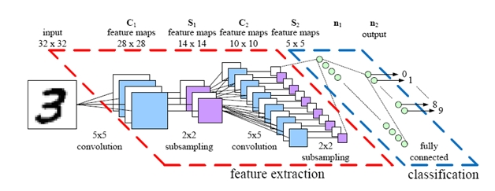
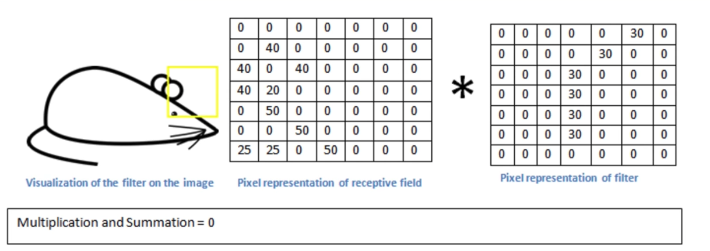

# Basic Concepts of Deep Learning 02
###### Peter Cha 

*  Deep Learning을 이해하고, 직접 Deep Learning을 구현하고자 했을 때 필요한 기본 개념들을 정리해 보았습니다. 이번 포스팅에서는 `Epoch, Batch`라는 단어들의 의미와, 기본적인 `CNN - Convolutional Neural Network`에 대한 키워드들을 다룹니다. 유명한 [MNIST](https://tensorflowkorea.gitbooks.io/tensorflow-kr/content/g3doc/tutorials/mnist/download/) 데이터를 학습하는 모델을 만들고 싶다고 했을 때, 언급한 키워드들이 어떤 의미로 사용되는지 예시로 함께 보려합니다. 
 
* In this post, you will learn the Concepts needed when you need to understand the process training AI or implement the AI by yourself. We are going to talk about `Epoch, Batch`, and basic `CNN` knowledges.
 Supposed we want to make a model which classifies [MNIST](https://tensorflowkorea.gitbooks.io/tensorflow-kr/content/g3doc/tutorials/mnist/download/) data, let's check how the keywords above can be used.

## MNIST

*  MNIST data는 아래에서 보시는 것처럼 0 ~ 9까지의 숫자가 적혀 있는, 손글씨 data입니다. 따라서 총 10가지의 class가 있습니다. 이 데이터를 이용해서 우리가 학습시키고 싶은 모델은 따라서 새로운 손글씨 data를 보더라도 0 ~ 9중에 어떤 숫자인지 잘 맞추는 AI가 될 것입니다. 
 

###### Images from [tensorflow.gitbooks.io](https://tensorflowkorea.gitbooks.io/tensorflow-kr/content/g3doc/tutorials/mnist/download/).

* As you can see above, MNIST is a dataset of handwritten digits, 0 to 9. Therefore, MNIST dataset has 10 classes to distinguish. Using this data, Our model to be trained will be able to distinguish 0 ~ 9 handwritten digits.

 

## Epoch, Batch
* MNIST는 Training data로 총 6만 장의 수기로 된 숫자를 제공하고, Test용으로 1만 장을 제공하는 Dataset입니다. 자, 그럼 우리는 6만장을 한꺼번에 모델에게 주고 학습해!라고 하면 될까요? 먼 미래에 Local machine이 아주 강력한 physical을 가졌다면 가능하겠지만, 지금은 그렇게 했다가는 메모리가 터져버릴 것입니다. 
 
* 그래서, 우리는 이 데이터들을 특정한 양으로 나눠서 조금씩 학습을 할 수 있게 넣어주는데요, 그 작은 단위를 `Batch`라고 부르고, 그 Batch의 크기가 어떠한지를 일컫는 말로, `Batch size`라고 말합니다. 
  
* 우리가 Batch size를 100으로 정했다고 하면, 총 몇 번의 반복을 해야 총 60000장의 Training data를 다 한 번씩 모델이 학습할 수 있게 될까요? 600번 일 것입니다. 그럼 실제로, 우리 모델은 100장의 데이터를 가져와서 한 번 돌고, 앞에서 배운 Back propagation을 통해, Weight를 Update하게 되면, 그 다음 100장을 가져와서 또 학습을 똑같이 반복하는 이 행위를 총 600번을 하게 됩니다. 그렇게 600번을 다 돌았을 때, 우리는 `'1 epoch를 돌았다'`라고 말합니다. 참고로, 이 600번을 Step size라고 일컫습니다. 

 

## CNN
* **CNN**은 **C**onvolution **N**eural **N**etwork의 약어로, Convolution 계산이 어떻게 Neural Network 2D 이미지 계산과 관련이 있는지는 [여기](https://brunch.co.kr/@chris-song/24)를 참고해주세요. 이 글에서는, CNN에서 자주 언급되는, Filter, Kernel, Stride,  Pooling, 그리고 Padding에 대해서 알아봅니다. 

### Feature(= Channel or Activation map)
* 잠시 MNIST대신에 고양이가 어떻게 생겼는지를 학습하는 Model을 만들고 있다고 생각해 봅시다. 그러면 RGB color로 된 사진을 넣어주게 되고, 우리는 모델에게 이 고양이에 대한 특징(Feature)을 추출해서 학습을 하라고 할 것입니다. 

###### Images from [ireneli.eu](https://ireneli.eu/2016/02/03/deep-learning-05-talk-about-convolutional-neural-network%EF%BC%88cnn%EF%BC%89/).

* 자, 그러면 우리 모델이 맨 처음 보게될 이미지는 Width, Height, 그리고 <u>Red, Green, Blue 3가지</u>로 이루어진 이미지를 받게 되는 것이죠. 이 때, 우리는 Channel이라고 부르는 부분으로 이 RGB인 Depth를 지칭합니다. 그러면 원본 이미지는 `'channel의 size가 3이다'`라고 말 할 수 있게 됩니다. 
* 우리 MNIST 이미지는 가로 28 pixel, 세로 28 pixel 짜리, 흑백 이미지입니다! 그러면 MNIST 이미지의 channel의 Size는 무엇일까요? <strike>정답은 1입니다!</strike>

###### Images from [parse.ele.tue.nl](http://parse.ele.tue.nl/cluster/2/CNNArchitecture.jpg).

* 이번에는 왜 이 Channel의 또다른 이름이 Feature, Feature maps인지 알아봅시다. 우리 MNIST 데이터가 위의 그림과 같이 들어간다고 했을 때, $C_1$을 보시면 5x5 크기의 Conv를 통과한 뒤, 이미지가 4겹(?)이 됐습니다. 이 때 우리는 Feature map의 size가 4가 됐다고 말할 수 있습니다. 그리고 $C_2$를 보시면 feature map이 12개가 됐죠. 
* 이런 행위를 해석을 하자면, 들어온 이미지에 대해서 `특징을 추출`했는데, $C_1$에서는 특징을 4개를 추출하고, $C_2$에서는 특징을 12개를 추출한 뒤 결과물이라고 생각하시면 됩니다. `'특징(Feature)을 추출한다'`라는 말이 무슨 말인지 이해를 돕기 위해서, 아래 사진을 준비했습니다. 

  
###### Images from [deliveryimages](https://deliveryimages.acm.org/10.1145/2010000/2000787/figs/f2.html).

* 위 사진은, 사람 얼굴을 학습하는 CNN 모델의 Layer별로 추출한 특징들을 시각화 한 것입니다. 맨처음엔 Pixel로 구성돼있는 원본 이미지에서 맨처음에는 취운 특징인 가로, 세로, 대각선, 원, 곡선 등등의 비교적 단순한 edge들만 특징으로 추출하고 있습니다. 
* 하지만 모델의 구조가 더 깊이 들어갈 수록, 그 단순한 Feature들을 조합해서 조금더 복잡한 눈, 코, 입 등을 그릴 수 있게 되고, 그 자체를 Feature로 삼을 수 있게 됩니다. 그러다 보면 사람의 전체전인 얼굴이라는 object를 Detect할 수 있는 모델이 되는 것이죠. 
* 그래서 제 개인적으로는 들어올 때는 Input Image의 Color라는 의미의 Channel로 부르는 것이 더 와닿다가, Layer를 통과할 수록 더욱더 정교한 특징들을 이미지에서 뽑기 때문에, Feature map이라는 말이 더 와닿으니 서로 혼용해서 같은 녀석을 부르는 것 같다는 느낌이 있습니다. 

### Kernel(= Filter) & Stride
* 바로 위에서 설명한 Feature Map은 이제 설명할 Kernel, 혹은 Filter라는 녀석을 통과한 뒤 나온 결과물 입니다. 
* 이미지가 들어왔을 때, kernel이라는 Window를 정하고, 그 Window를 움직이면서 그 Kernel이 가지고 있는 weight값들과 Input image와의 연산을 통해 새로운 값을 가진 Image를 생성하게 되는 것이죠. 아래 예시를 통해 더 자세히 알아 봅시다. 

###### Images from [blog.bkbklim.com](https://blog.bkbklim.com/2017/11/24/bks-machine-learning-ai-world-5-convolutional-neural-network/).

* 위 Animation에서 **Input**이미지는 **5x5** Size이고, **3x3** Size의 **Kernel**, 혹은 Filter가 한 칸씩 움직이면서 Image와 자신이 가지고 있는 Feature map을 계산하여 결과값을 내놓고 있습니다. **Kernel은 X자 모양의 Filter**네요. element-wise 곱, 즉, dot product를 계산하여 자신의 필터에 부합하는 위치면 곱한 값이, 아니면 0이 곱해져서 의미없는 0이 나오게 됩니다. 그렇게 나온 결과들을 **<u>다 더한 값</u>** 하나만 결과로 내놓습니다.  

* 여기서 등장하는 `Stride`! 자연스럽게 이 애니메이션에서는 한 칸씩 움직이고 있습니다만, **어디까지나, Stride가 1x1일 때의 움직임**입니다. **`Stride`는 <u>어느 정도의 간격을 가지고 Kernel 계산을 진행할 것인지</u>를 나타내는 척도**입니다. Stride가 2x2였다면, 두칸씩 움직일테고, 이 Input Size와는 맞지 않기 때문에 에러를 일으킵니다.

* 아래는 Filter를 설명하는 또 다른 이미지 인데요, 우리가 언급한 저 Filter에 보이는 $w$가 심상치 않습니다. 

* Backpropagation을 하면서 Update되는 Weight들은 다 저, Filter의 Weight들입니다! 더 명확한 특징들을 추출하기 위한 세련된 Filter가 되기 위해 그 weight들을 맞춰나가는 것이죠. 
* 그럼 이렇게 만들어진 Filter들을 통과하는 Feature map들은 어떻게 형성되는지, 더 명확한 이해를 위해 아래 사진을 보실까요.

###### Images from [deliveryimages](https://deliveryimages.acm.org/10.1145/2010000/2000787/figs/f2.html).

* 위와 같은 Filter가 하나 있습니다. 곡선을 찾는 Filter네요. 그럼 이 Filter가 들어온 쥐 이미지를 Stride에 맞게 돌아 다니게 됩니다. 그러면서, 이 곡선에 해당하는 위치가 있는지 찾습니다. 이 Filter가 한바퀴 다 돌고 완성된 Feature map은, 아래와 같이 해당 Filter에 반응하는 부분에 높은 숫자를, 아닌 부분에서는 0에 가까운 수를 가진 Feature map이 되는 것이죠. 

 

  
###### Images from [deliveryimages](https://deliveryimages.acm.org/10.1145/2010000/2000787/figs/f2.html).

#### 작아지는 Image Size
* 위에 나온 Animation에서 주목할 점은, **5x5 이었던 이미지 사이즈가, Kernel 계산을 마친 후, 3x3가 됐다는 것**입니다! 이런 계산이 저 위에 사진에서 보셨듯이 32x32 size였던 MNIST 이미지가, $C_1$에서 28x28이되고, $C_2$에서 10x10 size로 줄게 되었는지 설명할 수 있게 됩니다.

### Padding
* 이미지가 계속 Convolution layer를 통과하면서 작아지면 나중에는 1x1까지 가다못해 없어지지 않을까요?! 그래서 이미지의 Size가 너무 줄어들지 않게 이미지 주변에 값을 넣어주는 기법을 padding이라고 합니다. 가장 많이 쓰이는 Zero padding으로 예시를 보이자면 아래와 같습니다. 

* 저렇게 Kernel Size가 2x2이고, Stride가 1x1인 경우, 원본이 3x3 Size였으면 2x2 kernel로 계산을 해도 총 9번을 계산하여 원본 사이즈를 그대로 유지할 수 있게 됩니다. 

### Pooling
* Pooling은 Filter 계산이 아닌, kernel size에 해당하는 영역에 있는 값들을 일괄적으로 처리하고 싶을 때 사용합니다. 대표적인 Pooling으로 많이 쓰이는 Max Pooling의 개념은 아래와 같습니다. 

  
###### Images from [deliveryimages](https://deliveryimages.acm.org/10.1145/2010000/2000787/figs/f2.html).

* 말 그대로 2x2 Max pooling을 하겠다 하면, 해당 사이즈에서 가장 큰 값만 취하는 것이죠. 가장 중요한 정보만 취하겠다는 의도가 있습니다. 그 외에도 Average Pooling을 비롯한 다양한 Pooling이 있습니다. 
* 이 Pooling의 장점은, 무엇보다 **계산이 단순해서 계산량, Computation Cost가 작다는 것** 정도가 되겠습니다. 
* 위에서 배운 Padding을 응용해보면, Padding을 적당히 준 이미지에 Pooling을 하면 이미지 사이즈는 줄지 않지만 빠른 계산은 가능한 구조도 가능하겠죠? 

* 여기까지 기본적인 딥러닝 용어인, Batch, Epoch, 그리고 CNN의 기본 용어들을 살펴 보았습니다!
* 다음 포스팅에서는, Activation Function, MLP와 CNN의 차이점에 대해 이야기 해 보도록 하겠습니다. 

