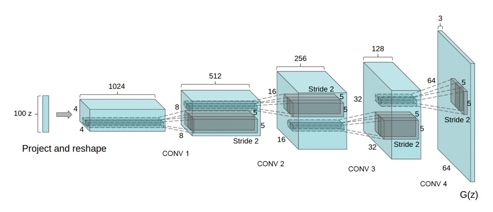
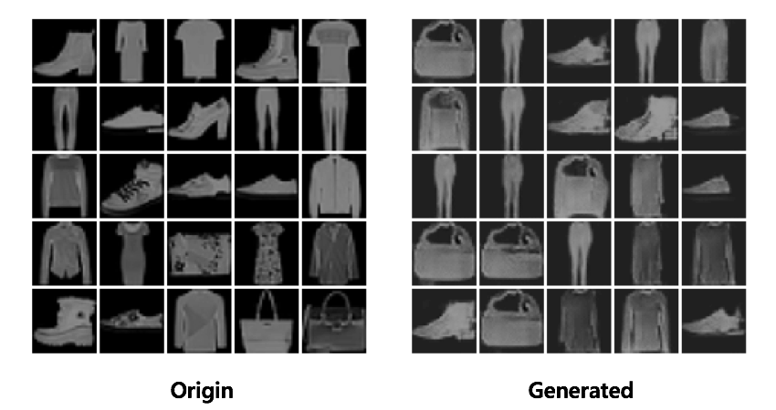

# DCGAN
##### Deep Convolutional GAN

* [DCGAN](https://arxiv.org/pdf/1511.06434.pdf) with Fashion MNIST data.
* GAN.py should be located at the same path.

  

## Environments
* <b>Ubuntu</b>: 16.08
* <b>GPU</b>: GTX 1080-ti * 4
* <b>Python</b>: 3.6
* <b>Tensorflow</b>: 1.10.0
* <b>Tensorpack</b>: 0.8.8

## Results
* **After 100 epochs**,

   

  

## Reference
* Tensorpack [Github](https://github.com/tensorpack/tensorpack/blob/master/examples/GAN/DCGAN.py)
