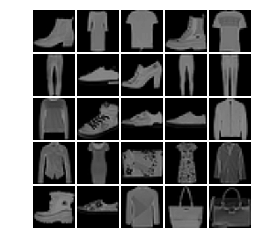
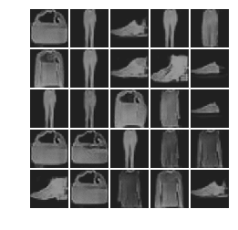

# DCGAN
##### Deep Convolutional GAN

* [DCGAN](https://arxiv.org/pdf/1511.06434.pdf) with Fashion MNIST data.
* GAN.py should be imported at the same path.
* [Reference](https://github.com/tensorpack/tensorpack/blob/master/examples/GAN/DCGAN.py)

 

## Result
 

 

## Environment
* Ubuntu 16.08
* GTX 1080-ti * 4
* Tensorflow 1.10.0
* Tensorpack 0.8.8
